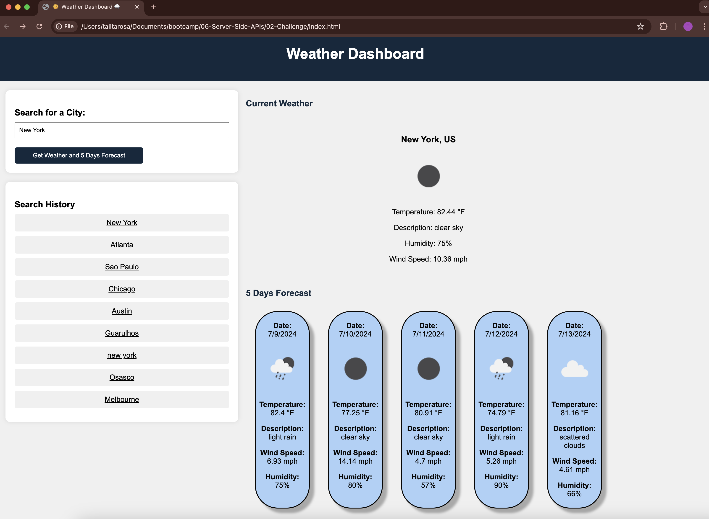

**Weather Dashboard** 🌞 🌧️

Welcome to the Weather Dashboard project! This web application fetches current weather and 5-day forecasts for cities using the OpenWeatherMap API. It allows users to search for cities, view current weather conditions, and see forecasts for the next 5 days.

## Features
* Search for a City: Enter a city name and click "Get Weather and 5 Days Forecast" to retrieve weather data.
* View Current Weather: Displays current temperature, description, humidity, and wind speed.
* See 5-Day Forecast: Shows daily forecasts including temperature, description, humidity, and wind speed.

## Mock-Up

The following animation demonstrates the application functionality:

* 

**Weather Dashboard**
* [The website application can be accessed using this link](https://titarosa.github.io/weatherdash_module6/) 

##License
This project is licensed under the MIT License 
